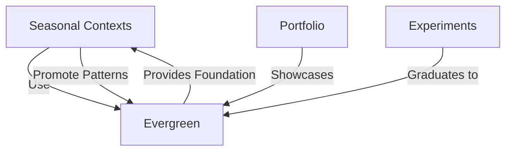

# Context: Evergreen

## Why This Exists

This context contains **timeless code**—tools, patterns, and integrations that remain valuable across all life seasons. Unlike seasonal contexts (like job-search-2025), these components are designed for long-term reuse and continuous refinement.

---

## What Makes Code "Evergreen"

Code belongs here if it:
- ✅ **Transcends specific life seasons** - Useful regardless of employment, location, or current goals
- ✅ **Provides foundational capabilities** - Core building blocks for other work
- ✅ **Improves with iteration** - Gets better over time, not obsolete
- ✅ **Has broad applicability** - Reusable across multiple projects

Code does NOT belong here if it:
- ❌ Solves a temporary problem (seasonal)
- ❌ Is tightly coupled to specific external services (experimental)
- ❌ Is exploratory or uncertain (experiments)
- ❌ Is showcase-ready but static (portfolio)

---

## Current Contents

### MCP Server Core
Model Context Protocol server implementation enabling AI assistants (Claude, Gemini, etc.) to interact with local tools and data.

**Why Evergreen:**
- MCP is a standard, not a trend
- Fundamental to personal AI assistant development
- Improves with AI ecosystem evolution
- Reusable across countless use cases

**Location:** `evergreen/mcp-server/`

### AI Utilities
Reusable AI integration patterns and utilities.

**Capabilities:**
- Gemini API wrappers
- Context management patterns
- Prompt engineering utilities
- Response parsing and validation

**Why Evergreen:**
- AI integration is long-term need
- Patterns improve with experience
- Abstracts away API changes
- Foundation for all AI-assisted work

**Location:** `evergreen/ai-utilities/`

### Shared Services
Common services used across multiple seasonal contexts.

**Examples:**
- Configuration management
- Logging and debugging
- File system utilities
- Data transformation helpers

**Why Evergreen:**
- Every project needs these
- Quality improves with reuse
- Reduces duplication
- Encapsulates best practices

**Location:** `evergreen/shared-services/`

---

## Promotion from Seasonal Contexts

When a season completes, evaluate code for promotion to evergreen:

### Promotion Criteria
1. **Proven Value** - Used successfully in completed season
2. **Clear Abstraction** - Decoupled from season-specific details
3. **Future Applicability** - Useful for upcoming seasons
4. **Quality Standard** - Well-tested, documented, maintainable

### Promotion Process
```bash
# Example: Promoting a pattern from job-search to evergreen
cd contexts/archive/2025-job-search-COMPLETE

# Identify reusable component
# e.g., context-aware AI prompting pattern

# Extract to evergreen
cp -r services/contextPrompting ../evergreen/ai-utilities/

# Document in learnings
echo "Promoted contextPrompting pattern to evergreen" >> meta/LEARNINGS.md

# Update evergreen CONTEXT.md
# Add entry explaining the new component
```

---

## Maintenance Philosophy

### Continuous Refinement
Evergreen code is **cultivated**, not frozen:
- Refactor when patterns emerge
- Update documentation as understanding deepens
- Add tests when edge cases discovered
- Improve abstractions based on usage

### Breaking Changes
When major refactoring needed:
1. Create new version alongside old
2. Mark old version deprecated
3. Update seasonal contexts incrementally
4. Remove deprecated after full migration

### Documentation Standard
Every evergreen component must have:
- Clear README explaining purpose
- Usage examples
- API documentation
- Known limitations
- Change log

---

## Relationship to Other Contexts



**Evergreen as Foundation:**
- Seasonal contexts import from evergreen
- Portfolio pieces built on evergreen patterns
- Experiments validate before promoting to evergreen

---

## Success Criteria

Evergreen code is successful if:

✅ **Frequently reused** - Multiple seasons depend on it  
✅ **Rarely broken** - Changes don't cascade into breaks  
✅ **Continuously improved** - Gets better over years  
✅ **Well understood** - Future me comprehends past decisions  
✅ **Properly abstracted** - Not coupled to specific use cases  

---

## Future Vision

As my career evolves, evergreen will contain:
- Personal AI assistant frameworks
- Data analysis pipelines
- Automation patterns
- Integration utilities
- Theoretical application models

This is **living infrastructure**—the foundation that makes all other work possible.

---

**Status:** 🌲 EVERGREEN  
**Last Updated:** 2025-12-26  
**Components:** MCP Server, AI Utilities, Shared Services
